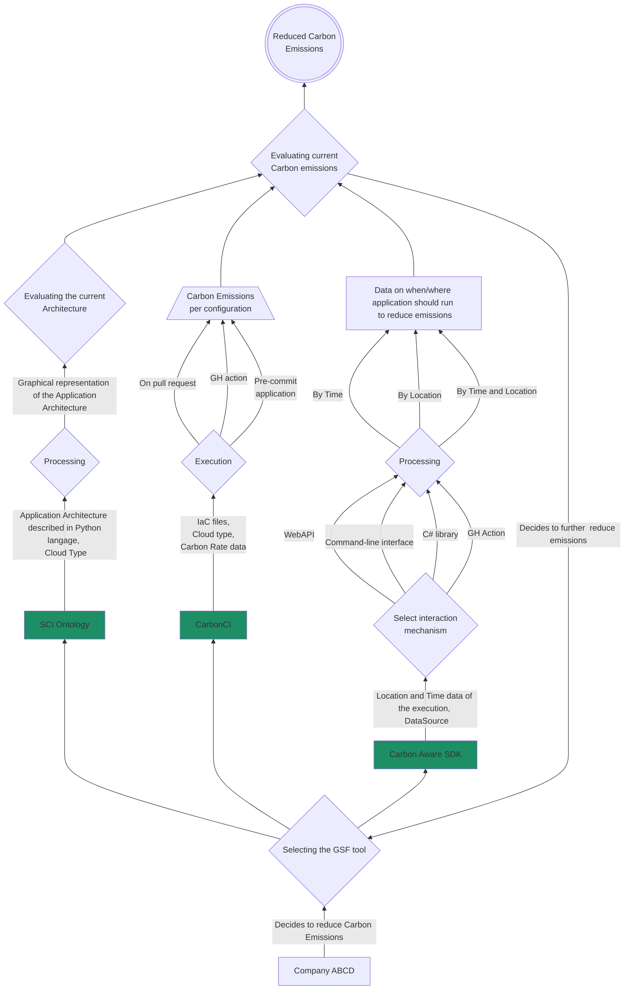

```mermaid
flowchart BT
classDef gsfProjectClass fill:#1d8e65
    0[Company ABCD] -->|Decides to reduce Carbon Emissions| 1
    1{Selecting the GSF tool} --> 2[CarbonCI]:::gsfProjectClass
    2 --> |IaC files, \n Cloud type, \n Carbon Rate data| 3{Execution}
    3 --> |On pull request| 99[/Carbon Emissions \n per configuration\]
    3 --> |GH action| 99
    3 --> |Pre-commit \n application| 99
    1 --> 26[Carbon Aware SDK]:::gsfProjectClass
    26 --> |Location and Time data of the execution, \n DataSource| 26.5{Select interaction \n mechanism}
    26.5 --> |WebAPI| 27{Processing}
    26.5 --> |\n Command-line interface| 27
    26.5 --> |C# library| 27
    26.5 --> |GH Action| 27
    27 -->|By Time| 28[Data on when/where application should run \n to reduce emissions]
    27 -->|By Location| 28
    27 -->|By Time and Location| 28
    1 --> 11[SCI Ontology]:::gsfProjectClass
    11 --> |Application Architecture \n described in Python langage, \n Cloud Type| 12{Processing}
    12 --> |Graphical representation \n of the Application Architecture| 13{Evaluating the current \n Architecture}
    13 --> 100
    99 --> 100{Evaluating current \n Carbon emissions}
    28 --> 100
    100 --> |Decides to further  reduce emissions| 1
    100 --> 101(((Reduced Carbon \n Emissions)))
```
